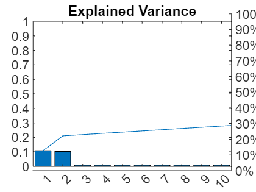

# POD of a scalar field using Matlabs's PCA function

```matlab:Code
clear; clc; close all;

```

## Sample Data based on Fernando Zigunov's example

```matlab:Code
[Vfield_Snapshots, xdata, ydata, t] = GeneratePistonInDuctVelocityField;
```

## Using PCA

The PCA method accepts data, X as n-by-p matrix of n observations and p variables. 

The snapshots above have are 3-dimensional with the first dimension as time the first dimension.

Reshape the data so that there are n observations in time, and each pixel is a variable

By default PCA centeres the data

PCA returns the coefficients (space), scores (evolution), explained variance (energy)

```matlab:Code
X = reshape(Vfield_Snapshots,size(Vfield_Snapshots,1),[]);
[p,s,~,~,e]=pca(X);
```

## PCA Relative explained variance (analogous to relative kinetic energy)

```matlab:Code
figure;
pareto(e/sum(e))
title('Explained Variance')
```



## Principal component  scores (analogous to POD time coefficients)

```matlab:Code
figure(Position=[969 102 811 357]);
hold on;
for moi = 1:3
    plot(t,s(:,moi),DisplayName="POM " + moi)
end
title('PCA scores')
hold off
legend('show')
```


## Principal component coeffients (analogous to POD modes)

```matlab:Code
figure;
tl=tiledlayout('flow',TileSpacing="compact",Padding="compact");
for moi = 1:3
    nexttile;
    imagesc(xdata,ydata,reshape(p(:,moi), ...
        numel(ydata),numel(xdata)));
    colormap jet
    xlabel('x/L');
    ylabel('y/H');
    set(gca,'ydir','normal')
    title("POM " + moi);
end
title(tl,"PCA coefficients")
```


